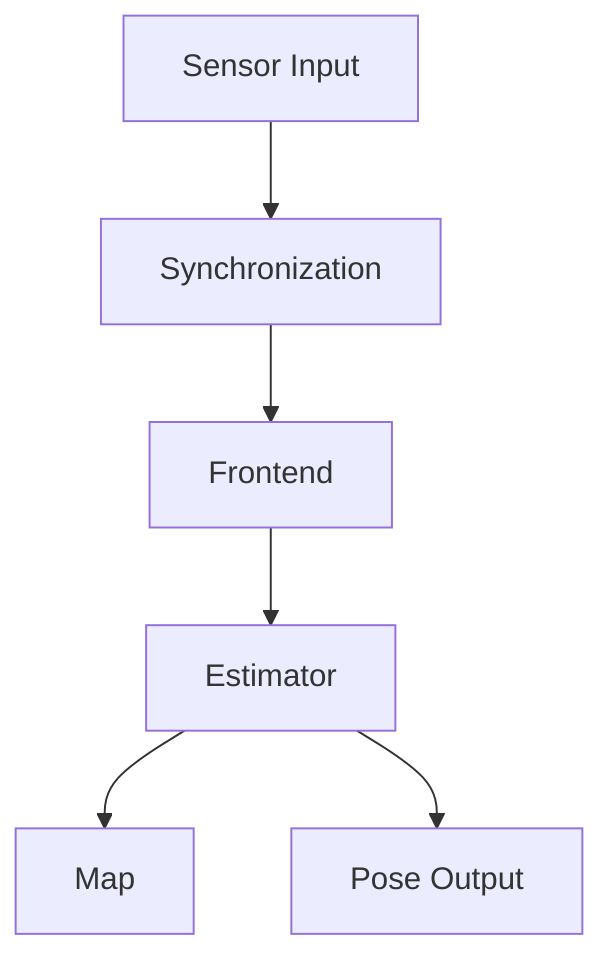
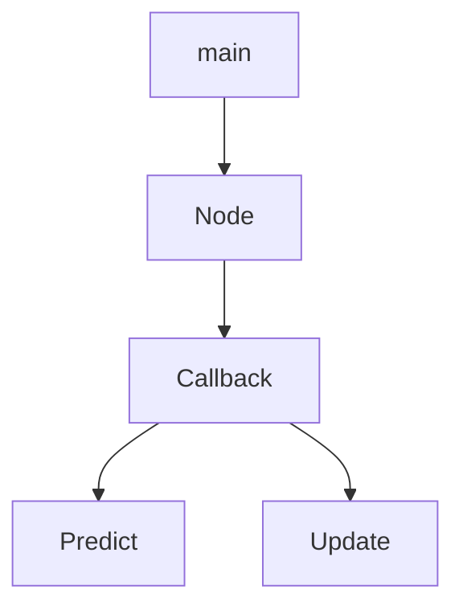
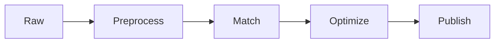
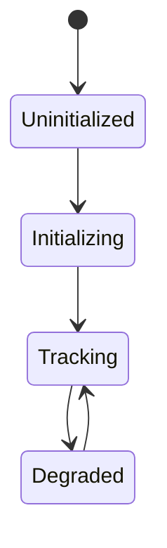

# Output Templates

Use this reference when deciding final response structure, diagrams, interview questions, debug reports, and learning roadmaps.

## Broad Repository Template

```markdown
## System Overview

## Architecture
Mermaid graph:
graph TD

## Module Relationship

## Call Graph

## Data Flow

## Control Flow

## Key Classes And State

## Core Functions

## Mathematics And Algorithms

## Paper Mapping

## Engineering Trade-Offs

## Performance And Realtime Behavior

## Debug Guide

## Extension Ideas

## Interview Questions

## Learning Roadmap
```

## Focused Function Template

```markdown
## Function
一句话作用：

## Inputs And Outputs

## Logical Blocks

## Mathematical Meaning

## Engineering Meaning

## Complexity

## Failure Modes

## Next Reading
```

## Debug Template

```markdown
## Symptom

## Likely Causes
| Cause | Why It Fits | How To Check | Code Location |

## Investigation Order

## Instrumentation

## Fix Direction

## Regression Check
```

## Paper Mapping Template

```markdown
## Paper Target

## Symbol Mapping
| Paper | Meaning | Code | Location |

## Equation/Algorithm Mapping

## Implementation Differences

## Assumptions And Risks
```

## Interview Template

Generate questions by level:

```markdown
## Interview Questions

### Junior
1. Question
   Reference answer:
   Follow-up:

### Mid-Level

### Senior

### Expert

### Architect
```

Prefer questions that require reasoning from the analyzed code:

- Why this state definition?
- Why this data structure?
- What breaks if timestamps drift?
- How would you add loop closure?
- How would you debug divergence?
- How would you reduce latency?

## Learning Roadmap Template

```markdown
## Learning Roadmap
1. Read `file/function` because ...
2. Read `file/function` because ...
3. Reproduce this experiment/log because ...
4. Study this prerequisite because ...
```

Keep the roadmap concrete and local to the repository when possible.

## Mermaid Patterns

Architecture:



Call graph:



Pipeline:



State machine:



## Style

- Use Chinese for explanatory prose when the user writes Chinese.
- Keep symbol names, file paths, APIs, and code identifiers unchanged.
- Prefer tables for mappings and bullet lists for staged plans.
- Keep final answers concise unless the user explicitly requests a full report.
- Use local file links when referencing files in the current workspace.
